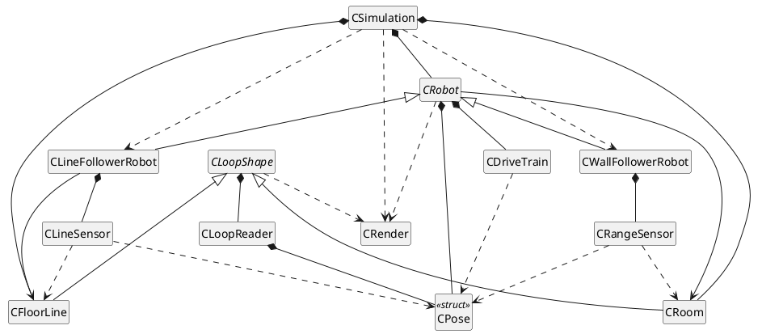

# A2 — UML Class Diagram

Unit's simplified standard: class names only, no members or methods. `hide
members` / `hide circle` keep the boxes to just names.



`main` (not a class) constructs one `CSimulation` and one `CRender`, calls
`CSimulation::LoadMaps` then `CSimulation::Run`.

## Relationships explained

| From | To | Type | In the code |
|---|---|---|---|
| `CWallFollowerRobot`, `CLineFollowerRobot` | `CRobot` | generalisation | share pose, drive train, trail, counts, the `Update()` loop and `Draw()`; each overrides only `Sense()` and `SteerFromSensors()` |
| `CRoom`, `CFloorLine` | `CLoopShape` | generalisation | share the segment chain and all ray/point geometry; each adds one query (`IsColliding` / `IsLineUnder`) and its own draw style |
| `CSimulation` | `CRoom`, `CFloorLine`, `CRobot`×2 | composition | members by value / `vector<unique_ptr<CRobot>>`; created in `LoadMaps`, destroyed with the simulation |
| `CRobot` | `CPose`, `CDriveTrain` | composition | `mPose`, `mDriveTrain` members |
| `CWallFollowerRobot` | `CRangeSensor`×2 | composition | side sensor (90°) + forward sensor (45°) members |
| `CLineFollowerRobot` | `CLineSensor`×2 | composition | inner sensor (over the line) + outer sensor (beside it) members |
| `CLoopShape` | `CLoopReader` | composition | `mLoopReader` member; parses the `.map` file |
| `CLoopReader` | `CPose` | composition | stores the loop's start pose |
| `CRobot` | `CRoom` | association | holds `const CRoom&` for collision checks; does **not** own it |
| `CLineFollowerRobot` | `CFloorLine` | association | holds `const CFloorLine&` to sense against; does **not** own it |
| `CSimulation` | `CWallFollowerRobot`, `CLineFollowerRobot` | dependency | constructs both in `LoadMaps` (`make_unique`), then holds them only as `CRobot` |
| `CRangeSensor` | `CRoom` | dependency | `Sense()` takes `const CRoom&`; keeps no reference |
| `CLineSensor` | `CFloorLine` | dependency | `Sense()` takes `const CFloorLine&`; keeps no reference |
| `CRangeSensor`, `CLineSensor`, `CDriveTrain` | `CPose` | dependency | each takes `const CPose&` as a parameter; stores none |
| `CSimulation`, `CRobot`, `CLoopShape` | `CRender` | dependency | drawing is passed a `CRender&`; the only place raylib is reachable |

## Points to make in the report

- **Two small inheritance hierarchies, each isolating one axis of variation.**
  `CRobot` isolates *how a robot senses and steers*; `CLoopShape` isolates
  *what a closed loop means* (a wall vs. a painted line). The bases hold the
  shared mechanism; the leaves hold only the difference.
- **`is-a` vs `has-a` applied consistently.** A line follower *is a* robot →
  inheritance. A robot *has a* drive train and *has* sensors → composition.
- **Ownership vs. use is explicit.** `CSimulation` owns the room, line and
  robots (composition). A robot only *refers* to the room it collides against
  (`const&` association) and never owns it. Sensors don't even keep a
  reference — they're handed the world each call (dependency).
- **raylib stays behind one class.** Every draw call routes through `CRender`;
  no other translation unit includes `raylib.h`.
```
